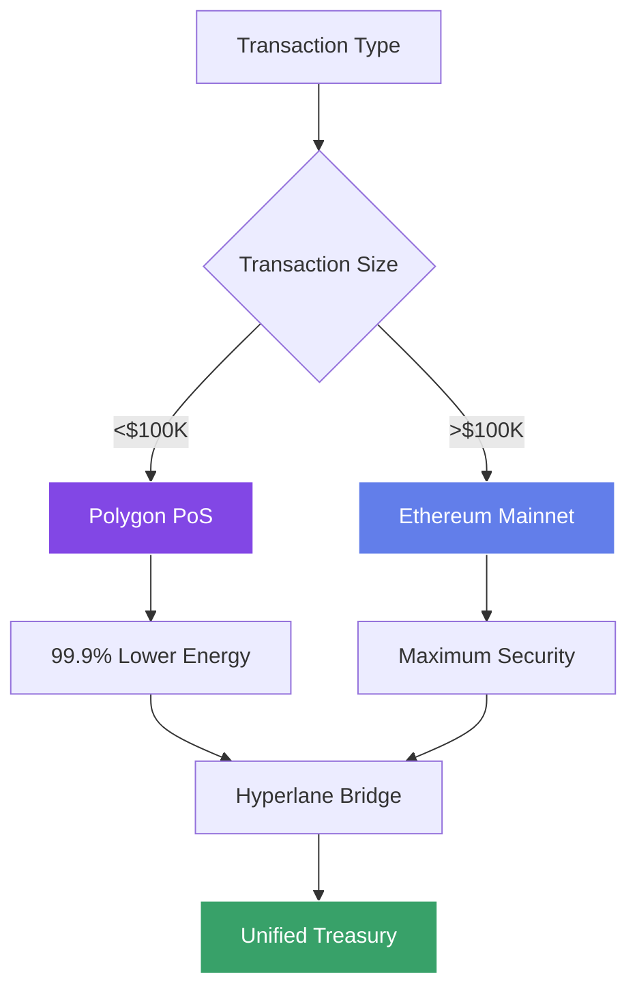
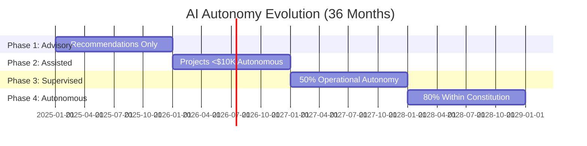

<div align="center">  
<p align="center">  
    
</p>

# 🌍 Autonomous AI Planetary Repair DAO
## Technical Whitepaper v3.0

🌐 APR-DAO Foundation | 📧 contact@apr-dao.org | 📄 [CC BY 4.0](https://creativecommons.org/licenses/by/4.0/legalcode)

<p align="center">  
  <a href="https://linkedin.com/in/therickyfoster"></a>  
  <a href="https://apr-dao.org"></a>  
  <a href="mailto:contact@apr-dao.org"></a>
  <a href="https://github.com/therickyfoster/apr-dao"></a>
  <a href="https://discord.gg/apr-dao"></a>
</p>

<p align="center">
  
  
  
  
</p>

</div>

---

## 🎯 Mission Statement


We architect **autonomous regenerative systems** that bridge AI intelligence with ecological wisdom, designing blockchain-native frameworks for planetary restoration and decentralized environmental governance. Our work focuses on creating comprehensive system blueprints for transforming traditional conservation into **transparent, AI-optimized, community-governed restoration networks**.

**Core Innovation**: A tiered autonomy framework that begins with AI-assisted human decision-making and progressively delegates operational decisions to AI systems within strictly defined parameters, ensuring both efficiency and accountability.

**Current Focus**: System architecture and development of integrated blockchain-environmental frameworks, with emphasis on scalable deployment patterns, verifiable impact measurement, and progressive autonomous governance.

<br clear="right"/>

---

## 📊 Project Analytics & Metrics

<div align="center">

### 🎯 36-Month Impact Projections

| Metric | 12 Months | 24 Months | 36 Months |
|--------|-----------|-----------|-----------|
| **Hectares Restored** | 150 | 500 | 2,000 |
| **Carbon Sequestered** | 500 tons CO2e | 2,000 tons | 10,000 tons |
| **Biodiversity Index +** | +15% | +35% | +60% |
| **Community Members** | 500 | 2,000 | 10,000 |
| **Treasury Value** | $2.2M | $3.5M | $6M |
| **Projects Launched** | 3 | 8 | 20 |
| **AI Autonomy Level** | Advisory | 20% | 50% |

### 💰 Financial Model

</div>

<div align="center">
<table>
<tr>
<td width="50%">

**Treasury Capitalization ($2M Target)**
- 🏦 Institutional Investors: $1.2M (60%)
- 🌐 Community Crowdfunding: $400K (20%)
- 🤝 Strategic Partnerships: $300K (15%)
- 👥 Founder/Team: $100K (5%)

</td>
<td width="50%">

**Asset Allocation (Year 1)**
- 💵 Stablecoins: 50% ($1M)
- ₿ ETH/BTC: 25% ($500K)
- 📈 DeFi Yield: 15% ($300K)
- 🚨 Emergency: 10% ($200K)

</td>
</tr>
</table>
</div>

---

## 🛠️ Technology Stack & Architecture

<div align="center">

### Blockchain & Smart Contracts


### AI & Machine Learning


### Environmental Monitoring


### Web Development & Infrastructure


</div>

---

## 🚀 Featured System Components

<div align="center">

<table>
<tr>
<td width="50%">

### 🏛️ Governance Core
**Progressive Autonomy Framework**

<div align="center">

</div>

Multi-signature treasury management with time-locked upgrades, constitutional constraints, and emergency circuit breakers. Human oversight progressively transitions to AI autonomy based on proven performance.

**Key Features:**
- ✅ 3-of-5 multisig for operations <$50K
- ✅ 48hr-7day time delays
- ✅ Community veto power always retained
- ✅ Formal verification of all contracts

</td>
<td width="50%">

### 🤖 AI Decision Engine
**Machine Learning for Environmental Impact**

<div align="center">

</div>

Computer vision for satellite imagery analysis, outcome prediction models trained on 10+ years of restoration data, and risk assessment algorithms for project selection.

**Current Capabilities:**
- ✅ Deforestation detection (95%+ accuracy)
- ✅ Project success prediction
- ✅ Resource optimization
- ✅ Real-time monitoring integration

</td>
</tr>

<tr>
<td width="50%">

### 📡 Impact Oracle Network
**Multi-Source Verification System**

<div align="center">

</div>

Decentralized data aggregation from satellites (Planet Labs, Sentinel-2), IoT sensors, field verification teams, and community reporting through mobile apps.

**Data Sources:**
- 🛰️ Satellite monitoring (daily imagery)
- 📡 IoT sensor networks (continuous)
- 🚶 Field verification (quarterly)
- 📱 Community reports (real-time)

</td>
<td width="50%">

### 🌱 Project Factory
**Standardized Deployment Framework**

<div align="center">

</div>

Modular smart contract templates for rapid project deployment across forest, wetland, grassland, and marine ecosystem restoration with automated milestone tracking.

**Project Types:**
- 🌲 Forest restoration (ANR + planting)
- 🌊 Wetland rehabilitation
- 🌾 Grassland recovery
- 🐠 Marine ecosystem restoration

</td>
</tr>
</table>

</div>

---

## 📋 Executive Summary

### 💡 The Problem

**Traditional environmental restoration is broken:**
- **$100B+** annual funding with **<30%** reaching actual projects
- **18-month average delays** between funding and implementation
- **40% project failure rate** due to inadequate monitoring
- Political cycles (2-4 years) vs. ecosystem timelines (10-50 years)
- Opaque decision-making and corruption vulnerability

### 🎯 Our Solution

**APR-DAO creates a blockchain-native platform that:**
1. **Eliminates intermediaries** → 80%+ of capital reaches projects directly
2. **Enables real-time verification** → Satellite + IoT + AI monitoring
3. **Ensures transparency** → All decisions recorded on-chain
4. **Progressively automates** → AI handles routine operations, humans guide strategy
5. **Remains accountable** → Community veto power always preserved

### 🏆 Competitive Advantages

| Traditional Conservation | Competitors (Toucan, Klima) | **APR-DAO** |
|-------------------------|------------------------------|-------------|
| Political funding cycles | Carbon credit trading only | **Direct restoration funding** |
| <30% capital efficiency | No physical projects | **>80% to ground operations** |
| 6-12 month reporting | Speculative offset markets | **Real-time verification** |
| Opaque processes | Single focus (carbon) | **Multi-ecosystem approach** |
| Static management | No governance evolution | **Progressive AI autonomy** |

---

## 📈 Market Analysis

### 💰 Total Addressable Market (TAM)

<div align="center">

```
Environmental Restoration Services
├── Reforestation: $6.2B annually
├── Wetland restoration: $4.1B annually
├── Grassland rehabilitation: $2.8B annually
└── Marine ecosystem restoration: $1.9B annually
━━━━━━━━━━━━━━━━━━━━━━━━━━━━━━━━━━━━━━━━
PRIMARY MARKET: $15B annually (8% YoY growth)

Impact Verification & Monitoring: $3.2B annually

ReFi (Regenerative Finance): $12B by 2027

━━━━━━━━━━━━━━━━━━━━━━━━━━━━━━━━━━━━━━━━
TOTAL TAM: $30B+ by 2027
```

</div>

### 🎯 Go-To-Market Strategy

**Phase 1 (Months 1-12): Proof of Concept**
- Launch 3 pilot projects (forest, wetland, grassland)
- Partner with 2-3 established NGOs
- Demonstrate AI recommendation accuracy >90%
- Build community of 500+ active members

**Phase 2 (Months 12-24): Geographic Expansion**
- Scale to 8+ projects across 2 continents
- Introduce autonomous operations for <$10K decisions
- Develop white-label DAO deployment toolkit
- Achieve break-even on operational expenses

**Phase 3 (Months 24-36): Platform Maturity**
- 20+ active restoration projects
- 5+ independent organizations adopting framework
- AI autonomy at 50% (operational decisions)
- Financial sustainability achieved

---

## 🔧 Technical Architecture

### ⛓️ Blockchain Infrastructure

**Multi-Chain Strategy for Optimization**

<div align="center">



</div>

**Network Selection Rationale:**
- **Polygon PoS**: Operational transactions (<$100K), 99.9% lower energy than Ethereum
- **Ethereum Mainnet**: Treasury operations (>$100K), governance finalization
- **Hyperlane**: Cross-chain bridges for asset management and unified treasury

### 📜 Smart Contract Architecture

```
APR-DAO-Contracts/
├── governance/
│   ├── GovernanceCore.sol           // Immutable constitution
│   ├── TimelockController.sol       // 48hr-7day delays
│   ├── VotingModule.sol             // Token-weighted voting
│   └── EmergencyCircuitBreaker.sol  // Pause + fund recovery
│
├── treasury/
│   ├── TreasuryManager.sol          // Multi-sig operations
│   ├── AssetAllocator.sol           // DeFi yield strategies
│   ├── RiskManagement.sol           // Stop-loss mechanisms
│   └── RebalanceAutomation.sol      // Portfolio optimization
│
├── projects/
│   ├── ProjectFactory.sol           // Standardized deployment
│   ├── MilestoneVerifier.sol        // Progress tracking
│   ├── FundingEscrow.sol            // Conditional releases
│   └── ImpactCalculator.sol         // Carbon/biodiversity metrics
│
├── verification/
│   ├── ImpactOracle.sol             // Multi-source aggregation
│   ├── SatelliteDataAdapter.sol     // Planet Labs integration
│   ├── IoTSensorRegistry.sol        // Field device management
│   └── VerificationToken.sol        // ERC-1155 impact credits
│
├── ai/
│   ├── AIDecisionEngine.sol         // Upgradeable with governance
│   ├── ConfidenceThreshold.sol      // >90% for autonomous action
│   ├── ModelRegistry.sol            // Version control for AI models
│   └── HumanOverride.sol            // Emergency intervention
│
└── tokens/
    ├── EARTHGovernance.sol          // ERC-20 + voting extension
    └── ImpactCredits.sol            // ERC-1155 verified outcomes
```

### 🔒 Security Framework

| Layer | Implementation | Parameters |
|-------|----------------|------------|
| **Formal Verification** | Certora + Runtime Verification | All contracts pre-deployment |
| **Multi-Signature** | Gnosis Safe | 3-of-5 (<$50K), 5-of-7 (>$50K) |
| **Time Delays** | OpenZeppelin Timelock | 48hrs (ops), 7 days (governance) |
| **Circuit Breakers** | Pausable patterns | Automatic fund protection |
| **Audits** | Quarterly external | Top 3 firms rotation |
| **Bug Bounties** | Immunefi platform | Up to $100K critical |
| **Insurance** | Nexus Mutual + Fireblocks | $1M smart contract, $500K custody |

---

## 🤖 AI Decision Support System

### Current Capabilities (Proven Technology)

<div align="center">

```python
class EnvironmentalDecisionEngine:
    """
    Production-ready AI for environmental restoration optimization
    """
    
    def __init__(self):
        # Computer Vision: 95%+ accuracy on satellite imagery
        self.satellite_analyzer = EfficientNetV2(
            pretrained=True,
            num_classes=len(RESTORATION_CATEGORIES)
        )
        
        # Outcome Prediction: 10+ years training data
        self.outcome_predictor = GradientBoostingRegressor(
            n_estimators=1000,
            learning_rate=0.01,
            max_depth=7
        )
        
        # Risk Assessment: Project success/failure ML
        self.risk_assessor = XGBoostClassifier(
            objective='binary:logistic',
            eval_metric='auc'
        )
        
        # Budget Optimization: Linear programming
        self.optimizer = PuLP.LpProblem(
            "MaximizeImpact",
            PuLP.LpMaximize
        )
```

</div>

### 📅 Progressive Autonomy Roadmap

<div align="center">



</div>

| Phase | Timeline | AI Authority | Human Oversight | Success Criteria |
|-------|----------|--------------|-----------------|------------------|
| **1: Advisory** | Months 1-12 | 0% (recommendations) | 100% approval | 95%+ correlation |
| **2: Assisted** | Months 12-24 | 20% (<$10K projects) | 80% strategic | <5% failure rate |
| **3: Supervised** | Months 24-36 | 50% (operations) | 50% strategy | Self-sustaining |
| **4: Autonomous** | Months 36+ | 80% (constitutional) | 20% mission | 10+ DAO network |

### 🛡️ AI Safety Mechanisms

**Decision Confidence Requirements:**
```javascript
const AI_CONFIDENCE_THRESHOLDS = {
    AUTONOMOUS_APPROVAL: 0.90,    // >90% confidence required
    ASSISTED_APPROVAL: 0.75,      // 75-90% with human review
    MANDATORY_REVIEW: 0.75,       // <75% requires full committee
    EMERGENCY_HALT: 0.50          // <50% triggers circuit breaker
};
```

**Safety Protocols:**
- ✅ Monthly adversarial testing against historical failures
- ✅ Bias detection across geographies and ecosystems
- ✅ Regular model retraining with ground-truth data
- ✅ Human-in-the-loop for novel situations
- ✅ Community veto power (72-hour window)
- ✅ Emergency override by governance council

---

## 🏛️ Governance Evolution Framework

### Phase 1: Human-Centric Governance (Months 1-12)

**Decision Authority Distribution**
```
┌────────────────────────────────────┐
│ Human Council:        100%         │
│ AI Role:              Advisory     │
│ Community:            Proposal     │
└────────────────────────────────────┘
```

**Governance Structure:**
- **Executive Council** (7 members)
  - 3 × Environmental Scientists (PhD, 10+ years)
  - 2 × Blockchain/AI Technologists
  - 2 × Community Representatives (elected)

- **Advisory Board** (15 experts)
  - 5 × Environmental Science
  - 5 × Technology (blockchain, AI, IoT)
  - 5 × Impact Investing

- **Community Assembly**
  - All EARTH token holders
  - 1 token = 1 vote
  - 10,000 EARTH minimum for proposals

### Phase 2: Hybrid Autonomy (Months 12-24)

**Decision Authority Distribution**
```
┌────────────────────────────────────┐
│ Human Oversight:      80%          │
│ AI Autonomous:        20%          │
│ Community Veto:       Always       │
└────────────────────────────────────┘
```

**Automated Decision Categories:**
- ✅ Project funding <$10K (proven methodologies)
- ✅ Treasury rebalancing (±5% from target)
- ✅ Vendor payments (approved contracts)
- ✅ Impact token issuance (after verification)
- ✅ Operational expenses <$5K

**Human-Retained Decisions:**
- ❌ Strategic direction and mission
- ❌ New project categories
- ❌ Funding >$50K
- ❌ Emergency response
- ❌ Constitutional amendments

### Phase 3: Supervised Autonomy (Months 24-36+)

**Decision Authority Distribution**
```
┌────────────────────────────────────┐
│ AI Strategic:         50%          │
│ Human Strategic:      50%          │
│ AI Operational:       80%          │
│ Community Veto:       Always       │
└────────────────────────────────────┘
```

**Constitutional Constraints (Immutable):**
```solidity
contract ConstitutionalLimits {
    uint256 public constant MAX_PROJECT_FUNDING = 5; // 5% of treasury
    uint256 public constant MIN_CONTINENTS = 2;
    uint256 public constant MAX_COUNTRY_ALLOCATION = 30; // 30%
    uint256 public constant MIN_ECOSYSTEM_TYPES = 3;
    uint256 public constant MIN_SUCCESS_RATE = 85; // 85% required
}
```

---

## 💰 Financial Model & Token Economics

### 🏦 Treasury Capitalization

**Phase 1 Target: $2M (Conservative)**

<div align="center">

| Source | Amount | Percentage | Status |
|--------|--------|------------|--------|
| 🏛️ Institutional Investors | $1,200,000 | 60% | Target Q1 2026 |
| 🌐 Community Crowdfunding | $400,000 | 20% | Gitcoin + Public Sale |
| 🤝 Strategic Partnerships | $300,000 | 15% | NGOs + Corporations |
| 👥 Founder/Team | $100,000 | 5% | Committed |

</div>

### 📊 Asset Allocation Strategy

**Year 1: Conservative Approach**
```
Portfolio Composition
├── 50% Stablecoins (USDC, USDT)     $1,000,000
│   └── Operational stability, zero volatility
├── 25% ETH/BTC                       $500,000
│   └── Long-term appreciation, moderate risk
├── 15% DeFi Yield Strategies         $300,000
│   ├── Aave lending (4-6% APY)
│   ├── Curve stablecoin pools
│   └── Conservative protocols only
└── 10% Emergency Reserves            $200,000
    └── Cash + T-Bills, instant liquidity
```

**Year 2-3: Balanced Growth**
```
Evolution Strategy
├── 40% Stablecoins (reduced for growth)
├── 20% ETH/BTC (core holding)
├── 20% DeFi Yield (expanded protocols)
├── 10% Tokenized Environmental Assets
│   ├── Carbon credit tokens
│   ├── Biodiversity credits
│   └── ReFi protocol tokens
└── 10% Emergency Reserves (maintained)
```

### 🪙 EARTH Token Economics

**Total Supply: 100,000,000 EARTH (Fixed)**

<div align="center">

```
Token Distribution
├── 30% Community (30M)
│   ├── 15M: Public sale
│   ├── 10M: Ecosystem incentives (4-year vest)
│   └── 5M: Liquidity mining
├── 25% Team & Advisors (25M)
│   └── 4-year linear vest, 1-year cliff
├── 25% DAO Treasury (25M)
│   └── Governance-controlled initiatives
├── 15% Early Investors (15M)
│   └── 2-year linear vest, 6-month cliff
└── 5% Strategic Partners (5M)
    └── Immediate unlock for operations
```

</div>

### Token Utility Matrix

| Use Case | Requirement | Benefit | APY/Reward |
|----------|-------------|---------|------------|
| **Governance Voting** | 1 EARTH = 1 vote | Shape project direction | - |
| **Proposal Submission** | 10,000 EARTH | Submit proposals | - |
| **Staking Rewards** | Min 1,000 EARTH | Treasury yield share | 3-5% APY |
| **Priority Access** | 5,000 EARTH | Early impact token access | - |
| **Validator Nodes** | 50,000 EARTH | Run verification nodes | 5-8% APY |
| **Platform Discounts** | Any amount | Fee reductions | 10-25% off |

### 📈 Revenue Projections (Conservative)

| Year | Revenue Streams | Amount | Expenses | Net | Treasury Growth |
|------|----------------|--------|----------|-----|-----------------|
| **Year 1** | DeFi yield + Impact tokens | $50K | $50K | $0 | Break-even |
| **Year 2** | DeFi + Carbon credits + Services | $180K | $150K | +$30K | 1.5% |
| **Year 3** | Diversified revenue | $400K | $300K | +$100K | 5% |
| **Year 5** | Self-sustaining ecosystem | $1.2M | $900K | +$300K | 15% |

---

## 🗺️ Implementation Roadmap

### 📅 Phase 1: Foundation (Months 1-8)

<details>
<summary><strong>🏗️ Click to Expand Detailed Timeline</strong></summary>

**Month 1-2: Legal & Organizational Setup**
- ✅ Swiss Association (Verein) incorporation
- ✅ Multi-jurisdictional entities (Cayman, Delaware, Singapore)
- ✅ Legal opinions on token classification
- ✅ Team contracts and IP documentation
- **Budget**: $80K

**Month 2-4: Technical Development**
- ✅ Smart contract architecture design
- ✅ Core contracts (Governance, Treasury, Projects)
- ✅ AI integration and oracle systems
- ✅ Governance platform (Snapshot + UI)
- **Budget**: $320K
- **Team**: 6 developers (Solidity, AI/ML, Backend, Frontend, DevOps)

**Month 3-5: Partnership Development**
- ✅ 2 × Environmental NGOs (WWF, TNC, CI)
- ✅ 1 × Satellite provider (Planet Labs)
- ✅ 1 × Verification firm (Verra, Gold Standard)
- ✅ 3 × Blockchain partners (Chainlink, Polygon, The Graph)
- **Budget**: $50K

**Month 4-6: Capital Raising**
- ✅ $2M target ($1.2M institutional, $400K community, $300K strategic)
- ✅ Investor deck and roadshow
- ✅ Community pre-sale (Gitcoin Grants)
- ✅ Token sale smart contract
- **Budget**: $70K

**Month 6-8: Pilot Project Launch**
- ✅ 50-100 hectares reforestation
- ✅ IoT sensors + satellite baseline
- ✅ Community mobile app rollout
- ✅ First on-chain impact data
- **Budget**: $75K

**Total Phase 1 Budget: $595K**

</details>

### 📅 Phase 2: Validation (Months 8-18)

<details>
<summary><strong>🌱 Click to Expand Expansion Strategy</strong></summary>

**Month 8-12: Geographic Expansion**

**New Project Categories:**
1. **Wetland Restoration** (Month 9)
   - Location: Southeast Asia or North America
   - Scale: 25-50 hectares
   - Budget: $60K

2. **Grassland Rehabilitation** (Month 11)
   - Location: Africa or South America
   - Scale: 100+ hectares
   - Budget: $40K

**AI System Advancement:**
- ✅ AI-assisted project selection
- ✅ Automated risk scoring
- ✅ Predictive outcome modeling
- ✅ First autonomous decision (<$5K)

**Month 12-18: Technology Maturation**
- ✅ Mainnet deployment (Polygon + Ethereum)
- ✅ Real-time impact dashboard (public)
- ✅ Automated milestone
